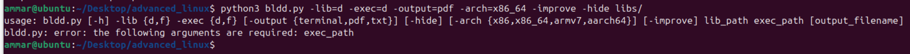
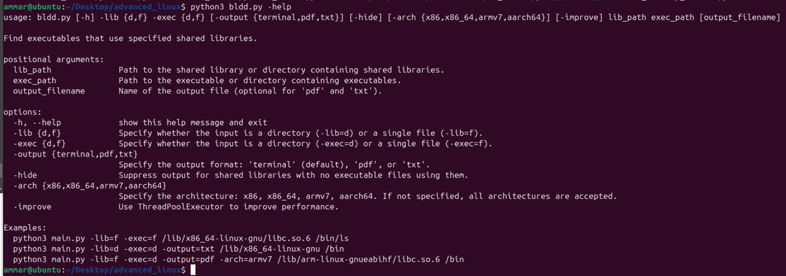
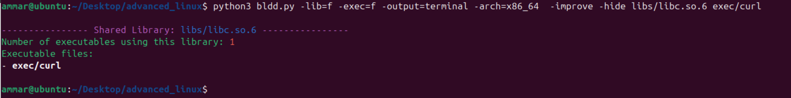
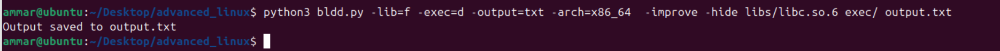
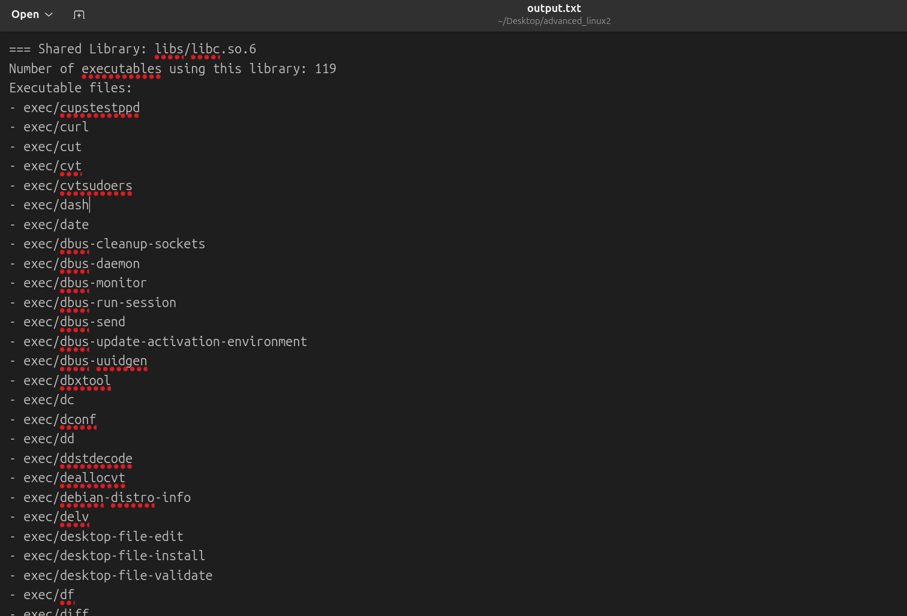
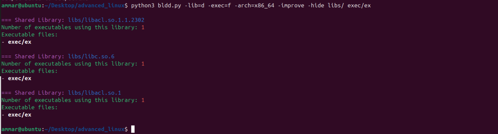
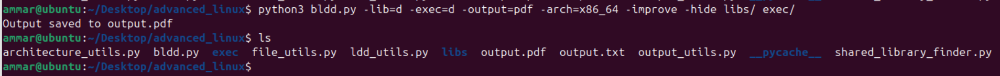
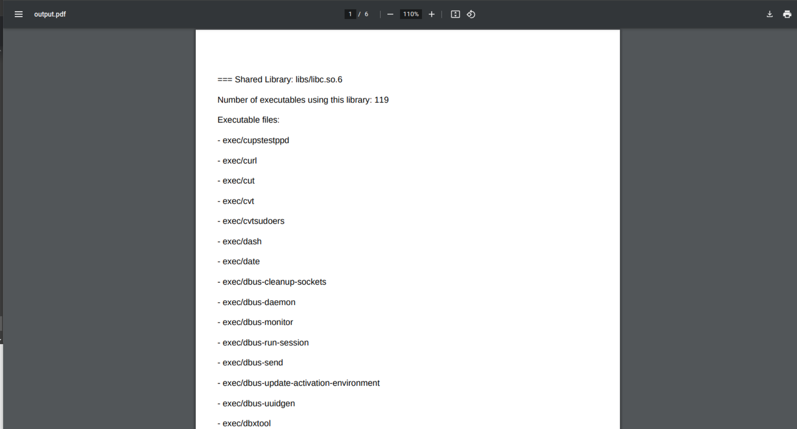

#### Ammar Meslmani - CBS-01

the full report with files can be found [here](https://github.com/spaghetti-cod3r/advanced_linux)

# Lab1: ELF

## Description

This `bldd` app is a command-line tool designed to find executables in a specified directory (or a single file) that use a given shared library (or a directory of shared libraries). It supports cross-architecture analysis and provides output in multiple formats (terminal, text file, or PDF).

## Implementaiton

let's divide the logic of the app into several files, each is going to handle different logic:

1. **bldd.py**: entry point of the app, it parses the arguments and it's responsible for the whole process orchestration
2. **file_utils.py**: executes necessary checks on files and detects shared library objects
3. **architecture_utils.py**:it detects the architecture of the file
4. **ldd_utils.py**: it extracts the shared library dependencies using `objdump`
5. **shared_library_finder.py**: it handles the logic of finding shared libraries and executables
6. **output_utils.py**: it handles the output saving and formatting

## Specification

the app supports flags which makes it flexable for different use cases

- `-lib`: required flag, it specifies whether user wants to pass single shared library file `(-lib=f)`, or a directory of shared library files `(-lib=d)`
- `-exec`: required flag, it specifies whether user wants to pass single executable file `(-lib=f)`, or a directory of executable files `(-lib=d)`
- `-output`: optional flag, it directs the output to one of three possible destinations:
  - `terminal`: the default value
  - `pdf`: it generates the report in a pdf file (the default name is `output.pdf` unless if it was specified)
  - `txt`: it generates the report in a text file (the default name is `output.txt` unless if it was specified)
- `-arch`: optional flag, it specifies which architecture to handle out of the following:
  - `x86_64`
  - `x64`
  - `armv7`
  - `aarch64`
    **Note**: by default all the previous architectures are accepted unless if it was specified
- `-improve`: optional flag, if mentioned, the app will utilize threads to parallelize the execution and make it faster (by default it's disabled)
- `-hide`: optional flag, if mentioned, the app will hide shared libraries which have no corresponding executables from the report (by default it's disabled)
- `-help` or `-h`: to display the help page

## Interruption and Handling Errors

- the app handles erorrs related to missing/passing invalid flags and arguments with informative output which indicate where the error is
  
- the app performs graceful exit when receiving `ctrl + c` signal from the user
  

## Output

- the app displays the **Shared Libraries** sorted by the number of corresponding executables (from highest to lowest), and each **Executable Files** list is sorted lexicographically (alphabetically) for each shared library
- when `terminal` option is specified for output, **ANSI codes** are applied to the output to apply a colorful and readable output

## Help Page

help page can be accessed by executing `python3 bldd.py -help`:

output:

```
usage: bldd.py [-h] -lib {d,f} -exec {d,f} [-output {terminal,pdf,txt}] [-hide] [-arch {x86,x86_64,armv7,aarch64}] [-improve] lib_path exec_path [output_filename]

Find executables that use specified shared libraries.

positional arguments:
  lib_path              Path to the shared library or directory containing shared libraries.
  exec_path             Path to the executable or directory containing executables.
  output_filename       Name of the output file (optional for 'pdf' and 'txt').

options:
  -h, --help            show this help message and exit
  -lib {d,f}            Specify whether the input is a directory (-lib=d) or a single file (-lib=f).
  -exec {d,f}           Specify whether the input is a directory (-exec=d) or a single file (-exec=f).
  -output {terminal,pdf,txt}
                        Specify the output format: 'terminal' (default), 'pdf', or 'txt'.
  -hide                 Suppress output for shared libraries with no executable files using them.
  -arch {x86,x86_64,armv7,aarch64}
                        Specify the architecture: x86, x86_64, armv7, aarch64. If not specified, all architectures are accepted.
  -improve              Use ThreadPoolExecutor to improve performance.

Examples:
  python3 main.py -lib=f -exec=f /lib/x86_64-linux-gnu/libc.so.6 /bin/ls
  python3 main.py -lib=d -exec=d -output=txt /lib/x86_64-linux-gnu /bin
  python3 main.py -lib=f -exec=d -output=pdf -arch=armv7 /lib/arm-linux-gnueabihf/libc.so.6 /bin
```



## Requirements

- the following python libraries:

  - os
  - sys
  - argparse
  - signal
  - re
  - subprocess
  - threading
  - concurrent.futures
  - fpdf
- the sysetm dependencies:

  - objdump

## Examples and Proofs

to make quick and simple examples to visualize and test the functionality of the app, let's pick some libraries and copy them from `/lib/x86_64-linux-gnu/` to a local directory `/libs`, and let's copy some executable libraries from `/bin` to a local directory `/exec`

### Example 1

- let's run the app for a single library and a single executable file, and direct the output to the terminal:

  ```
  python3 bldd.py -lib=f -exec=f -output=terminal -arch=x86_64  -improve -hide libs/libc.so.6 exec/curl
  ```
- output:

  

### Example 2

- let's run the app for a single library and a directory of executable files, and direct the output to a text file `output.txt`:

  ```
  python3 bldd.py -lib=f -exec=d -output=txt -arch=x86_64  -improve -hide libs/libc.so.6 exec/ output.txt
  ```
- output:

  

  

### Example 3

- let's run the app for a directory of libraries and a single executable file, and direct the output to the terminal:

  ```
  python3 bldd.py -lib=d -exec=f -arch=x86_64 -improve -hide libs/ exec/ex
  ```
- output:

  ```
  === Shared Library: libs/libacl.so.1.1.2302
  Number of executables using this library: 1
  Executable files:
  - exec/ex

  === Shared Library: libs/libc.so.6
  Number of executables using this library: 1
  Executable files:
  - exec/ex

  === Shared Library: libs/libacl.so.1
  Number of executables using this library: 1
  Executable files:
  - exec/ex
  ```

  

### Example 4

- let's run the app for a directory of libraries and a directory of executable files, and direct the output to a pdf file:

  ```
  python3 bldd.py -lib=d -exec=d -output=pdf -arch=x86_64 -improve -hide libs/ exec/
  ```
- output:

  

  

## Attachments

- `bldd.py`
- `file_utils.py`
- `architecture_utils.py`
- `ldd_utils.py`
- `shared_library_finder.py`
- `output_utils.py`
- `output.txt` file from `Example 2`
- `output.pdf` file from `Example 4`
