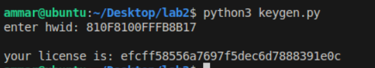
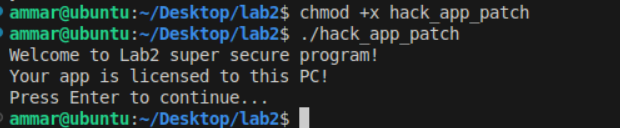

#### Ammar Meslmani - CBS-01

#### a.meslmani@innopolis.university

#### the repo link to check the output of this assignment: [full report](https://github.com/spaghetti-cod3r/advanced_linux/tree/main/lab2)

# Lab 2:

- let's unzip the file, check its type, and try to run it:
- 
- there is an issue because `libssl1.1` is missing
- let's solve the issue
- 
- all the dependencies are resolved now
- 
- now let's try to run the program again:
- 
- let's analyze the program using `Ghidra`:
- 
- now let's create a python keygen:

  ```
  import hashlib

  def generate_key(hwid):
      md5 = hashlib.md5(hwid.encode()).digest()

      # reverse md5
      reversed_md5 = md5[::-1]

      return reversed_md5.hex()

  def main():
      hwid = input("enter hwid: ").strip()

      license_key = generate_key(hwid)
      print(f"\nyour license is: {license_key}")

  if __name__ == "__main__":
      main()
  ```
- let's run the keygen and get the license:
- 
- let's check the license generated by the keygen:
- 
- now let's patch the following instruction so that `iVar1 = 0` to enforce setting `local_34[4]` to 1
- 
- let's use `XOR EAX, EAX` which is  fast operation which guarantees that `EAX` will be set to 0 because of the nature of `XOR` operation
- 
- now let's export and run the new patched program:
- 
- now let's create a python script which will patch given `hack_app` program, to do this let's compare the binaries of the patched and the original version of `hack_app`:
- 
- now let's create `patcher.py` which will apply the modification shown in the previous comparison:

  ```
  def patch_binary_file(input_file, output_file, original_line, patched_line):
      # hex strings to bytes
      if isinstance(original_line, str):
          original_line = bytes.fromhex(original_line.replace(" ", ""))
      if isinstance(patched_line, str):
          patched_line = bytes.fromhex(patched_line.replace(" ", ""))

      # open first file
      with open(input_file, 'rb') as f:
          data = f.read()

      # replace line
      modified_data = data.replace(original_line, patched_line)

      if modified_data == data:
          print("warning: the sequence was not found")
      else:
          print("patched Successfully!")

      # update the second file
      with open(output_file, 'wb') as f:
          f.write(modified_data)

  # original line
  original = "48 8D 3D A9 3A 00 00 E8 B4 FB FF FF 85 C0 75 07"
  # patched line 
  patched = "48 8D 3D A9 3A 00 00 31 C0 90 90 90 85 C0 75 07"


  patch_binary_file("hack_app", "patched", original, patched)
  ```
- let's run it and try running the generated program
- 
- it works successfully!
