#### Ammar Meslmani - CBS-01

#### a.meslmani@innopolis.university

#### the repo link to check the output of this assignment: [full report](https://github.com/spaghetti-cod3r/advanced_linux/tree/main/lab3)

# Lab 3:make defconfig

- let's ensure that `qemu-system`, `qemu-system-arm`, and `gcc-arm-linux-gnueabihf` are installed
- 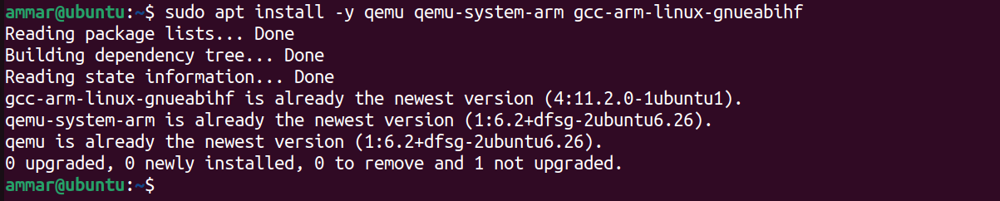
- let's compile and run `u-boot`
- 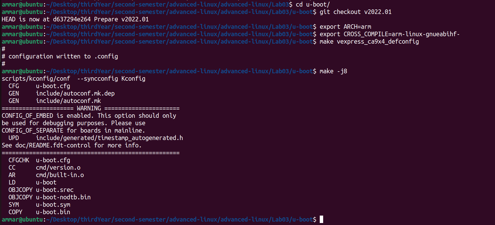
- let's test u-boot under qemu (it will faiil because there is no kernel yet to load)

  ```
  qemu-system-arm -M vexpress-a9 -kernel u-boot -m 512M -nographic
  ```
- 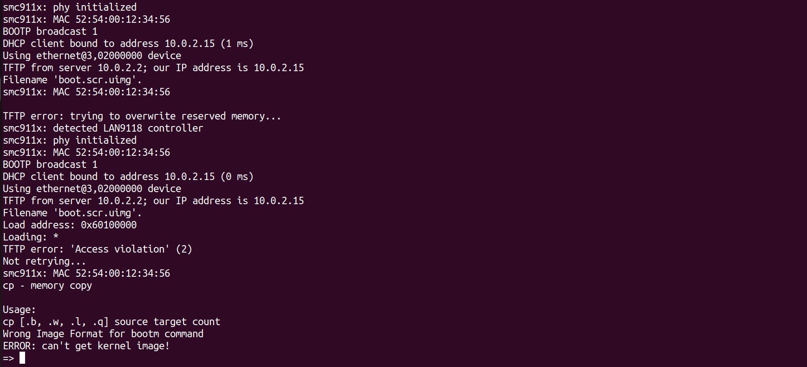
- now let's install linux kernel from `https://git.kernel.org/torvalds/t/linux-6.15-rc3.tar.gz`, unzip it, and then compile it
- 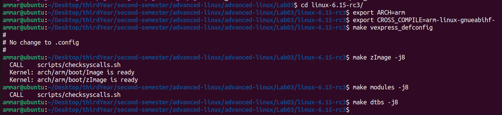
- now let's verify zImage boots

  ```
  qemu-system-arm -M vexpress-a9 -m 512M \
   -kernel arch/arm/boot/zImage \
   -append "console=ttyAMA0" \
   -dtb arch/arm/boot/dts/arm/vexpress-v2p-ca9.dtb \
   -nographic
  ```
- 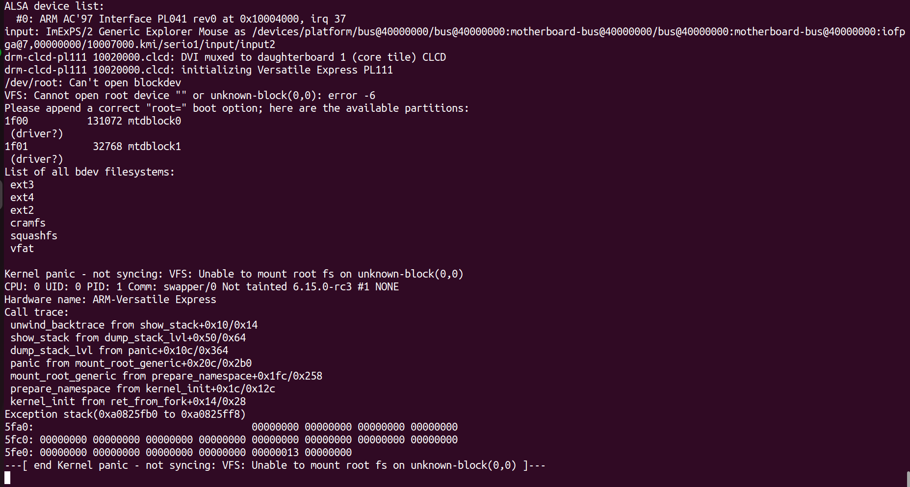
- now let's compile and configure `busybox`
- 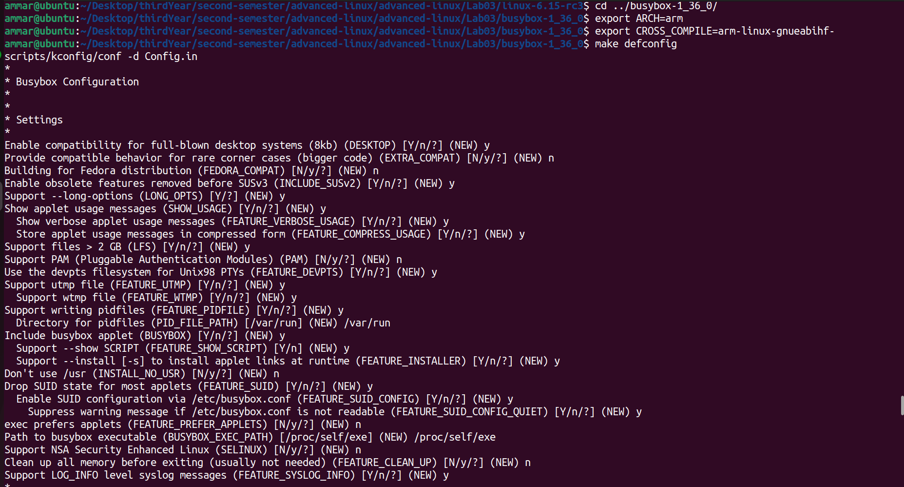
- let's enable `build static binary` and disable `tc` (it was causing errors during the install)

  ```
  make menuconfig
  ```
- 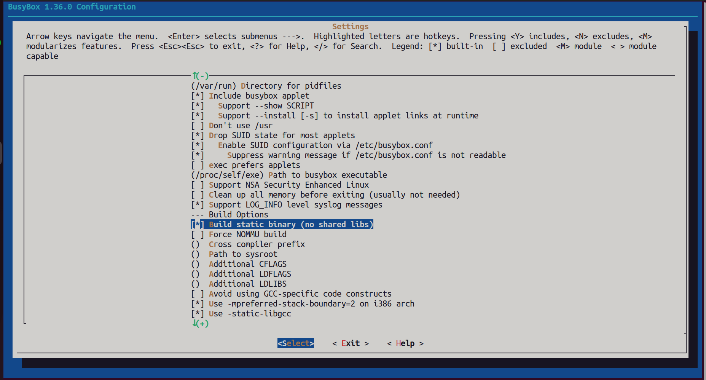
- 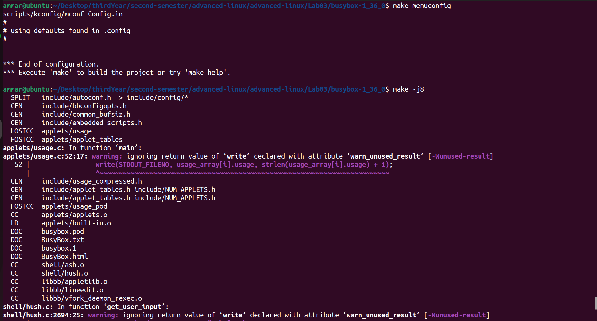
- and let's `make install`
- 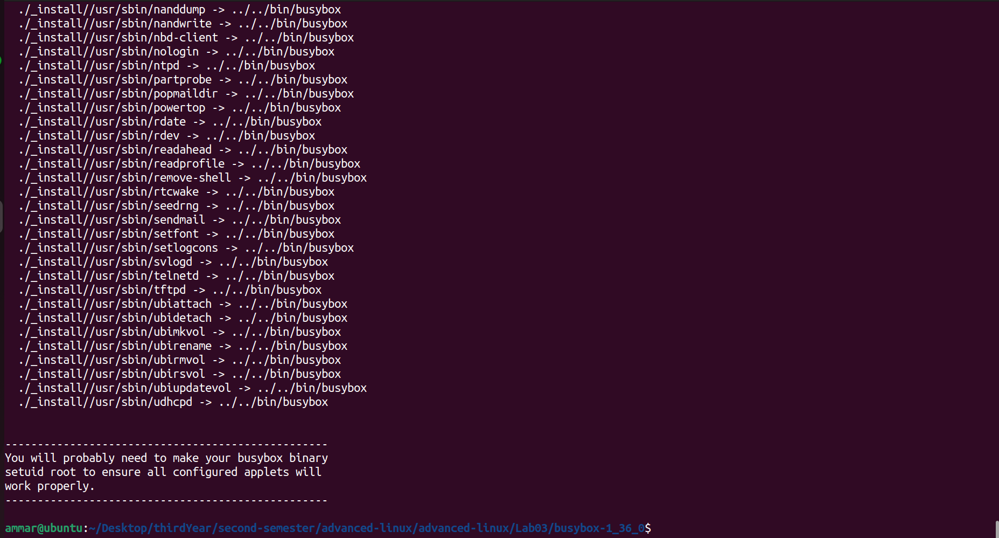
- now let's assemble the initramfs layout by navigating to '`ntiramfs/` and creating `init` file with the following

  ```
  #!/bin/sh
  mount -t proc none /proc
  mount -t sysfs none /sys
  mount -t devtmpfs none /dev
  mkdir /newroot
  mount -t ext4 /dev/mmcblk0p2 /newroot
  exec switch_root /newroot /sbin/init
  EOF
  ```

  and make it executable through

  ```
  chmod +x init
  ```

  and then package necessary file into `initramfs.cpio.gz` by executing

  ```
  find . -print0 | cpio --null -ov --format=newc | gzip -9 > ../initramfs.cpio.gz
  ```
- now let's prepare minimal `rootfs`
- 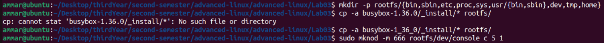
- now let's make a raw ext4 image and build 2‐partition SD image via fdisk
- 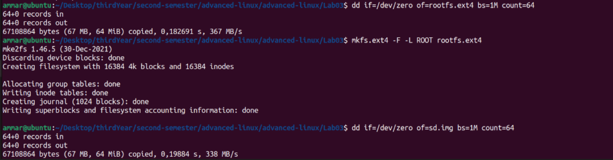
- 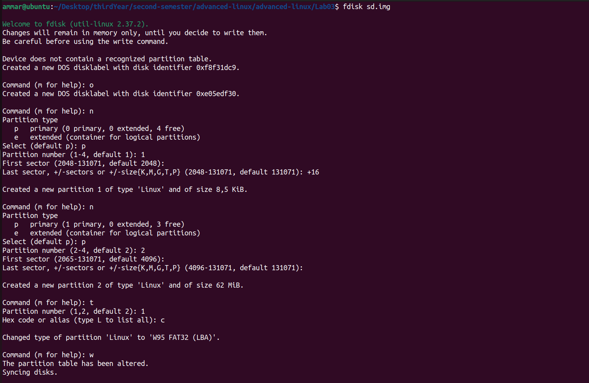
- now let's map and format partitions and add boot files to our boot parttition, and root files to our rootgs partition
- 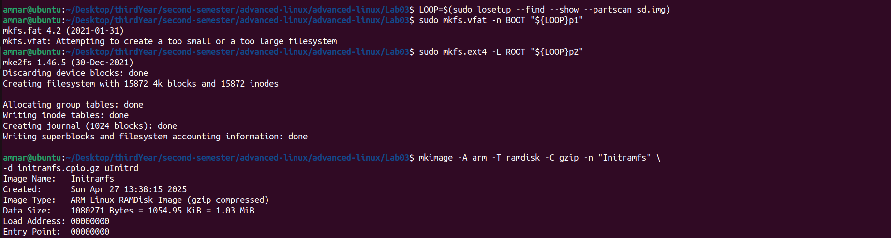
- 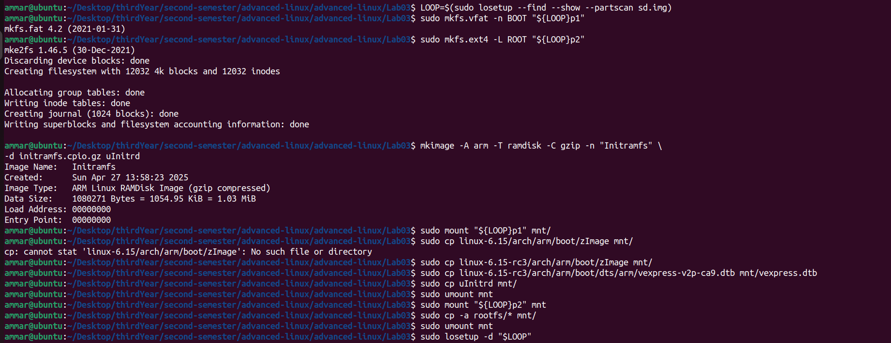
- now let's launch `u-boot` with out SD image through

  ```
  qemu-system-arm -M vexpress-a9 \
   -m 512M \
   -kernel u-boot/u-boot \
   -drive file=sd.img,format=raw,if=sd \
   -nographic
  ```
- let's load our artifacts and check
- 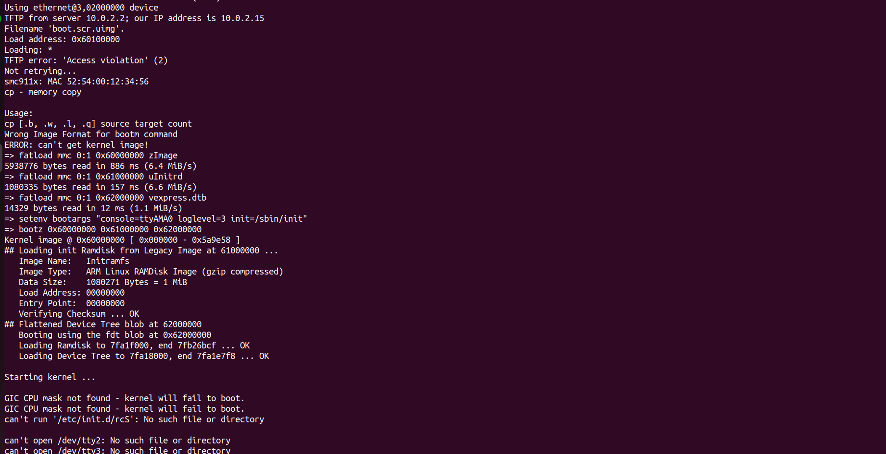
- 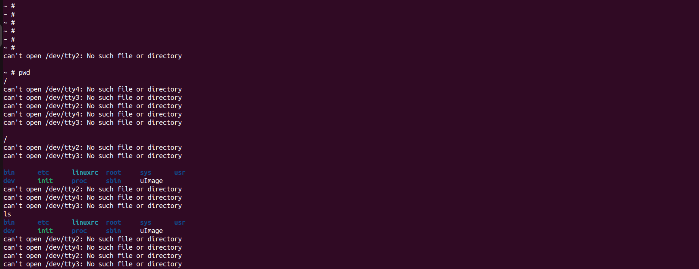


done!
