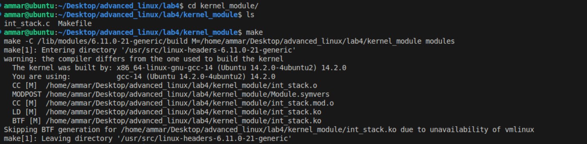
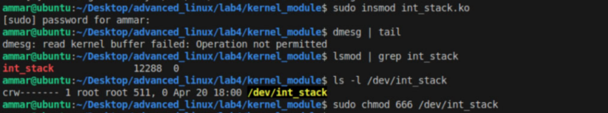
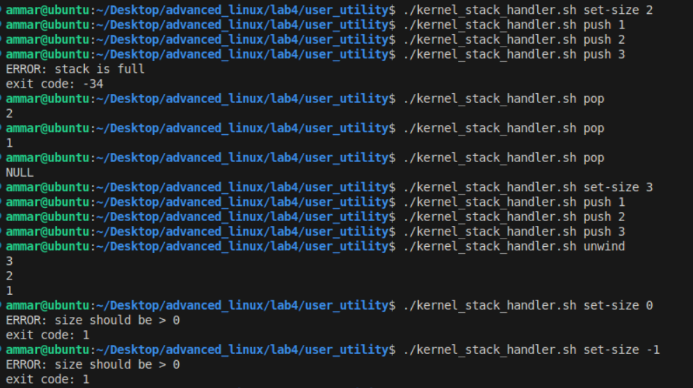

#### Ammar Meslmani - CBS-01

#### a.meslmani@innopolis.university

#### the repo link to check the output of this assignment: [full report](https://github.com/spaghetti-cod3r/advanced_linux/tree/main/lab4)

# Lab 4:

- let's create the core module with file operations under the file `int_stack.c`

  ```
  #include <linux/init.h>
  #include <linux/mutex.h>
  #include <linux/ioctl.h>
  #include <linux/module.h>
  #include <linux/fs.h>
  #include <linux/uaccess.h>
  #include <linux/device.h>
  #include <linux/cdev.h>
  #include <linux/slab.h>

  MODULE_LICENSE("GPL");
  MODULE_AUTHOR("Ammar Meslmani");
  MODULE_DESCRIPTION("Integer Stack Kernel Module");

  #define DEVICE_NAME "int_stack"
  #define STACK_IOCTL_MAGIC 's'
  #define STACK_IOCTL_SET_SIZE _IOW(STACK_IOCTL_MAGIC, 1, int)

  static dev_t dev_number;
  static struct class *stack_class = NULL;
  static struct cdev stack_cdev;

  struct int_stack {
      int *data;
      int top;
      int max_size;
      struct mutex lock;
  };

  static struct int_stack stack;

  static int stack_open(struct inode *inode, struct file *file) {
      return 0;
  }

  static int stack_release(struct inode *inode, struct file *file) {
      return 0;
  }

  static ssize_t stack_read(struct file *file, char __user *buf, size_t len, loff_t *offset) {
      int value;
      if (len < sizeof(int))
          return -EINVAL;

      if (mutex_lock_interruptible(&stack.lock))
          return -ERESTARTSYS;

      if (stack.top == 0) {
          mutex_unlock(&stack.lock);
          return 0;
      }

      value = stack.data[--stack.top];
      mutex_unlock(&stack.lock);

      if (copy_to_user(buf, &value, sizeof(int)))
          return -EFAULT;

      return sizeof(int);
  }

  static ssize_t stack_write(struct file *file, const char __user *buf, size_t len, loff_t *offset) {
      int value;
      if (len < sizeof(int))
          return -EINVAL;

      if (copy_from_user(&value, buf, sizeof(int)))
          return -EFAULT;

      if (mutex_lock_interruptible(&stack.lock))
          return -ERESTARTSYS;

      if (stack.top >= stack.max_size) {
          mutex_unlock(&stack.lock);
          return -ERANGE;
      }

      stack.data[stack.top++] = value;
      mutex_unlock(&stack.lock);
      return sizeof(int);
  }

  static long stack_ioctl(struct file *file, unsigned int cmd, unsigned long arg) {
      int new_size;
      int *new_data;

      if (cmd != STACK_IOCTL_SET_SIZE)
          return -EINVAL;

      if (copy_from_user(&new_size, (int __user *)arg, sizeof(int)))
          return -EFAULT;

      if (new_size <= 0)
          return -EINVAL;

      new_data = kmalloc_array(new_size, sizeof(int), GFP_KERNEL);
      if (!new_data)
          return -ENOMEM;

      mutex_lock(&stack.lock);
      kfree(stack.data);
      stack.data = new_data;
      stack.top = 0;
      stack.max_size = new_size;
      mutex_unlock(&stack.lock);

      return 0;
  }

  static struct file_operations fops = {
      .owner = THIS_MODULE,
      .open = stack_open,
      .release = stack_release,
      .read = stack_read,
      .write = stack_write,
      .unlocked_ioctl = stack_ioctl,
  };

  static int __init int_stack_init(void) {
      int ret;

      ret = alloc_chrdev_region(&dev_number, 0, 1, DEVICE_NAME);
      if (ret < 0)
          return ret;

      cdev_init(&stack_cdev, &fops);
      stack_cdev.owner = THIS_MODULE;

      ret = cdev_add(&stack_cdev, dev_number, 1);
      if (ret < 0) {
          unregister_chrdev_region(dev_number, 1);
          return ret;
      }

      stack_class = class_create("int_stack_class");
      if (IS_ERR(stack_class)) {
          cdev_del(&stack_cdev);
          unregister_chrdev_region(dev_number, 1);
          return PTR_ERR(stack_class);
      }

      if (device_create(stack_class, NULL, dev_number, NULL, DEVICE_NAME) == NULL) {
          class_destroy(stack_class);
          cdev_del(&stack_cdev);
          unregister_chrdev_region(dev_number, 1);
          return -1;
      }

      mutex_init(&stack.lock);
      stack.data = NULL;
      stack.top = 0;
      stack.max_size = 0;

      pr_info("int_stack module loaded. Device: /dev/%s\n", DEVICE_NAME);
      return 0;
  }

  static void __exit int_stack_exit(void) {
      mutex_destroy(&stack.lock);
      kfree(stack.data);
      device_destroy(stack_class, dev_number);
      class_destroy(stack_class);
      cdev_del(&stack_cdev);
      unregister_chrdev_region(dev_number, 1);
      pr_info("int_stack module unloaded\n");
  }

  module_init(int_stack_init);
  module_exit(int_stack_exit);
  ```
- then let's create `Makefile` which will build the kernel module:

  ```
  obj-m += int_stack.o

  KDIR := /lib/modules/$(shell uname -r)/build
  PWD := $(shell pwd)

  all:
  	make -C $(KDIR) M=$(PWD) modules

  clean:
  	make -C $(KDIR) M=$(PWD) clean
  ```
- now let's build the module
- 
- let's verify and load the module and create a node device
- 
- now let's create `stack_ioctl.h` header file:

  ```
  #ifndef STACK_IOCTL_H
  #define STACK_IOCTL_H

  #include <linux/ioctl.h>

  #define STACK_IOCTL_MAGIC 's'
  #define STACK_IOCTL_SET_SIZE _IOW(STACK_IOCTL_MAGIC, 1, int)

  #endif
  ```
- and let's create `kernel_stack.c` and include the previous header file:

  ```
  #include <stdio.h>
  #include <stdlib.h>
  #include <string.h>
  #include <fcntl.h>
  #include <errno.h>
  #include <unistd.h>
  #include <sys/ioctl.h>
  #include "stack_ioctl.h"

  #define DEVICE_PATH "/dev/int_stack"

  void usage() {
      fprintf(stderr, "Usage:\n");
      fprintf(stderr, "  kernel_stack set-size <n>\n");
      fprintf(stderr, "  kernel_stack push <n>\n");
      fprintf(stderr, "  kernel_stack pop\n");
      fprintf(stderr, "  kernel_stack unwind\n");
  }

  int main(int argc, char *argv[]) {
      if (argc < 2) {
          usage();
          return EXIT_FAILURE;
      }

      int fd = open(DEVICE_PATH, O_RDWR);
      if (fd < 0) {
          perror("Failed to open device");
          return EXIT_FAILURE;
      }

      int ret = 0;

      if (strcmp(argv[1], "set-size") == 0) {
          if (argc != 3) {
              usage();
              close(fd);
              return EXIT_FAILURE;
          }

          int size = atoi(argv[2]);
          if (size <= 0) {
              fprintf(stderr, "ERROR: size should be > 0\n");
              close(fd);
              return EXIT_FAILURE;
          }

          ret = ioctl(fd, STACK_IOCTL_SET_SIZE, &size);
          if (ret < 0) {
              perror("ioctl");
              close(fd);
              return errno;
          }

      } else if (strcmp(argv[1], "push") == 0) {
          if (argc != 3) {
              usage();
              close(fd);
              return EXIT_FAILURE;
          }

          int val = atoi(argv[2]);
          ret = write(fd, &val, sizeof(int));
          if (ret < 0) {
              if (errno == ERANGE) {
                  fprintf(stderr, "ERROR: stack is full\n");
              } else {
                  perror("write");
              }
              close(fd);
              return -errno;
          }

      } else if (strcmp(argv[1], "pop") == 0) {
          int val;
          ret = read(fd, &val, sizeof(int));
          if (ret == 0) {
              printf("NULL\n");
          } else if (ret < 0) {
              perror("read");
              close(fd);
              return errno;
          } else {
              printf("%d\n", val);
          }

      } else if (strcmp(argv[1], "unwind") == 0) {
          int val;
          while ((ret = read(fd, &val, sizeof(int))) > 0) {
              printf("%d\n", val);
          }

          if (ret < 0) {
              perror("read");
              close(fd);
              return errno;
          }

      } else {
          usage();
          close(fd);
          return EXIT_FAILURE;
      }

      close(fd);
      return 0;
  }
  ```
- let's compile:
- 
- now there is one last issue to solve, UNIX exit codes are 8 bits unsigned, so -34 in case of full stack error will be displayed as 222. to solve this issue, we can wrap our program with a shell script to check for the returned code, if it's larger than 127 then its original value is negative and has to be restored
- let's create `kernel_stack_handler.sh` to handle the previous issue:

  ```
  #!/usr/bin/env bash

  output="$(./kernel_stack "$@" 2>&1)"
  raw_status=$?

  # if >127, subtract 256 to restore the original value
  if (( raw_status > 127 )); then
    signed_status=$(( raw_status - 256 ))
  else
    signed_status=$raw_status
  fi

  # print any output from the command
  if [[ -n "$output" ]]; then
    printf '%s\n' "$output"
  fi

  # if there is an error, display its code
  if [ "$signed_status" -ne 0 ]; then
      printf 'exit code: %d\n' "$signed_status" >&2
  fi
  ```
- now let's use our handler and check the given instructions:
- 
