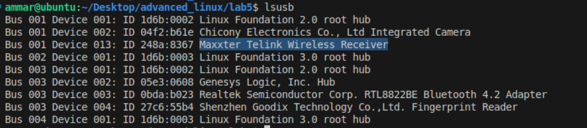
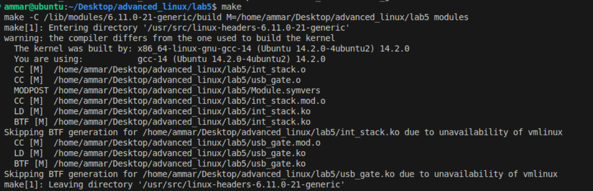
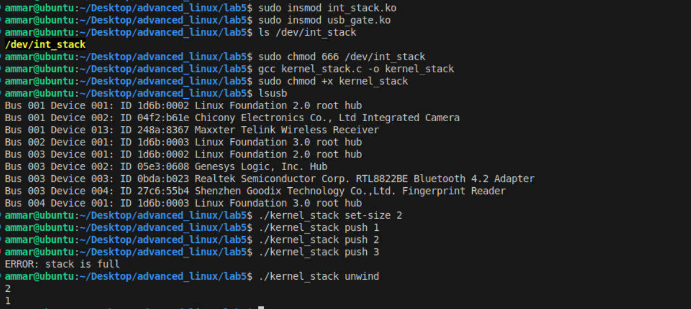
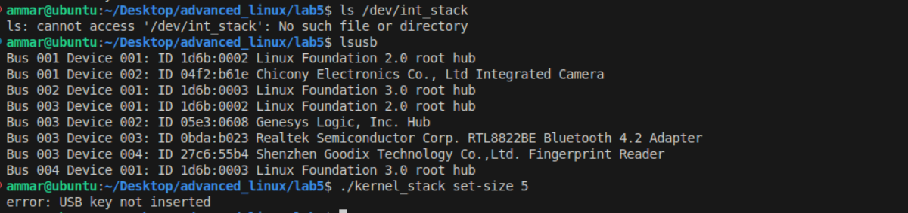

#### Ammar Meslmani - CBS-01

#### a.meslmani@innopolis.university

#### the repo link to check the output of this assignment: [full report](https://github.com/spaghetti-cod3r/advanced_linux/tree/main/lab5)

# Lab 5:

- we need to update `int_stack.c` so that device creation will be linked to USB key insertion and that by replacing the following:

  ```
  if (device_create(stack_class, NULL, dev_number, NULL, DEVICE_NAME) == NULL) {
      class_destroy(stack_class);
      cdev_del(&stack_cdev);
      unregister_chrdev_region(dev_number, 1);
      return -1;
  }
  ```
  with

  ```
  pr_info("int_stack: core initialized, waiting for USB key\n");
  ```
- let's check VID:PID of my little chinese wirleless mouse
- 
- let's create `usb_gate.c` file:

  ```
  #include <linux/module.h>
  #include <linux/usb.h>
  #include <linux/device.h>
  #include <linux/cdev.h>

  // imported from int_stack.ko
  extern dev_t dev_number;
  extern struct class *stack_class;

  static struct usb_device_id pen_table[] = {
      { USB_DEVICE(0x248a, 0x8367) },  // my little chinese wireless mouse's VID:PID
      {}
  };
  MODULE_DEVICE_TABLE(usb, pen_table);

  static int pen_probe(struct usb_interface *interface, const struct usb_device_id *id)
  {
      printk(KERN_INFO "USB key (%04X:%04X) inserted\n", id->idVendor, id->idProduct);

      if (stack_class) {
          device_create(stack_class, NULL, dev_number, NULL, "int_stack");
          printk(KERN_INFO "int_stack: device created by USB key\n");
      }

      return 0;
  }

  static void pen_disconnect(struct usb_interface *interface)
  {
      printk(KERN_INFO "USB key removed, removing /dev/int_stack\n");
      device_destroy(stack_class, dev_number);
  }

  static struct usb_driver pen_driver = {
      .name = "usb_stack_gate",
      .id_table = pen_table,
      .probe = pen_probe,
      .disconnect = pen_disconnect,
  };

  static int __init pen_init(void)
  {
      return usb_register(&pen_driver);
  }

  static void __exit pen_exit(void)
  {
      usb_deregister(&pen_driver);
  }

  module_init(pen_init);
  module_exit(pen_exit);

  MODULE_LICENSE("GPL");
  MODULE_AUTHOR("Ammar Meslmani");
  MODULE_DESCRIPTION("USB Gating Module for int_stack");
  ```
- and let's update `kernel_module.c` so that it displays the following error: `error: USB key not inserted` when the usb is not plugged in by updating the following part:

  ```
  int fd = open(DEVICE_PATH, O_RDWR);
  if (fd < 0) {
      if (errno == ENOENT || errno == ENODEV) {
          fprintf(stderr, "error: USB key not inserted\n");
      } else {
          perror("Failed to open device");
      }
      return EXIT_FAILURE;
  }
  ```
- now let's update `Makefile`:

  ```
  obj-m += int_stack.o
  obj-m += usb_gate.o

  KDIR := /lib/modules/$(shell uname -r)/build
  PWD := $(shell pwd)

  all:
  	make -C $(KDIR) M=$(PWD) modules

  clean:
  	make -C $(KDIR) M=$(PWD) clean
  ```
- and let's build:
- 
- now let's keep the usb plugged in and compile `kernel_stack.c` and try running it
- 
- now let's unplug the usb and try to run the program again
- 
- done!
